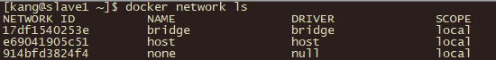
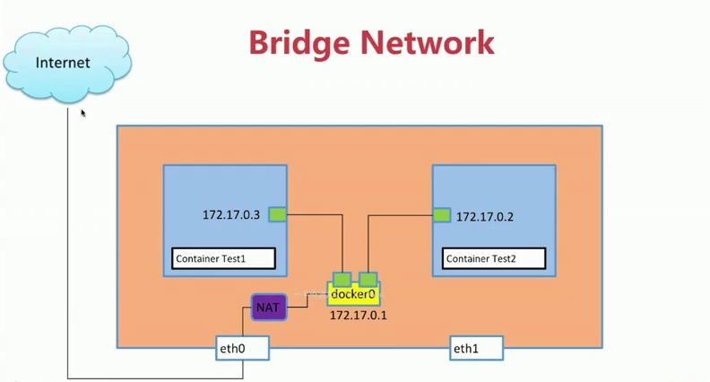

# Docker

## Docker简介

### Linux容器

> 对进程进行隔离

### Docker是什么

> Docker属于Linux容器的一种封装，提供简单易用的容器使用接口

### Docker的用途

- 提供一次性的环境
- 提供弹性的云服务
- 组建微服务架构

## Docker安装

### Docker for Centos

- 安装 [VirtualBox](https://www.virtualbox.org/wiki/Downloads)
- 安装 [Vagrant](https://www.vagrantup.com/downloads.html)  
新建目录--> vagrant init centos/7(生成vagrant file) --> vagrant up（下载并打开虚拟机）--> vagrant ssh(进入虚拟环境)  
[Vagrant库](https://app.vagrantup.com/boxes/search)  
- 其他命令:  
     vagrant status  
     vagrant destroy

- 安装[Docker](https://docs.docker.com/v17.12/install/linux/docker-ce/centos/#install-docker-ce-1)  

## Docker 架构和底层技术

> Docker提供了一个开发，打包，运行app的平台

### Docker Engine

- 后台进程（dockerd）
- REST API Server
- CLI接口 （docker）

### Docker Image

sudo gpasswd -a vagrant docker（加入docker组）

> - 文件和meta data的集合
> - 分层的，并且每一层都可以添加改变删除文件，成为一个新的image
> - 不同的image可以共享相同的layer
> - image本身是只读的

#### Image的获取

- Build form Dockerfile

> docker build -t name:tag .

- Pull form Registry

> docker pull [image](https://hub.docker.com/)

#### Image命令

- docker image ls
- docker image rm [imageName]

### Container

> - 通过Image创建
> - 在Image layer之上建立一个container layer（可读写）
> - Image负责app的存储和分发，Container负责运行app

#### Container命令

- docker commit [image name] [new image]  
把修改过的container创建image
- docker inspect [container id]
获取container详细信息

### Docker File

```bash
#制作base image
FROM scratch
FROM centos
#RUN 会生成新的分层
RUN yum update && yum install -y vim
#WORKDIR 指定当前目录
#ADD 添加本地文件到工作目录并解压
#COPY 添加本地文件到工作目录
#ENV 设置常量
#EXPOSE 将端口暴露出来
```

> RUN:执行命令并创建新的Image Layer  
> CMD:设置容器启动后默认执行的命令和参数  
> ENTRYPOINT:设置容器启动时运行的命令

### 容器的操作

```bash
docker exec -it [container id] /bin/bash
docker exec -it [container id] python
```

## Docker Network

### 常用工具

> ping ：验证ip的可达性  
ping [ip地址]  
> telnet：验证服务的可用性  
telnet [ip] [port]  

### 网络命名空间

> 容器有独立的网络命名空间，并且能相互ping通  
> ip a查看网络

### Docker Bridge

  
单机通信网络默认的三种driver  

```bash
# 只可以通过exec访问容器，其他方式无法访问
docker run -d --name test --network none busybox /bin/sh -c "while true; do sleep 3600; done"
```

```bash
# 和主机共享网络命名空间，端口会发生冲突
docker run -d --name test --network host busybox /bin/sh -c "while true; do sleep 3600; done"
```

  
创建容器默认会连接bridge，通过veth pair进行连接，通过NAT访问外网，本地可访问bridge网络

>     docker network ls  //查看network列表  
>     docker network inspect [network id] //查看network的详细信息
>     brctl show //查看所有bridge网络的详细信息  

#### 创建自定义bridge

>     docker network create -d bridge my-bridge  //创建bridge网络
>     docker run -d --name test3 --network my-bridge busybox /bin/sh -c "while true; do sleep 3600; done" //指定network
>     docker network connect my-bridge test2 //加入自定义bridge的容器自动link，既可以使用名字代替ip地址

### Docker link

>     #创建两个容器，test2容器通过--link 指定test1,在test2容器内部就可以使用test1替代test1容器的ip地址  
>     docker run -d --name test1  busybox /bin/sh -c "while true; do sleep 3600; done"  
>     docker run -d --name test2 --link test1 busybox /bin/sh -c "while true; do sleep 3600; done"  

### Docker 容器端口本地映射

>     docker run --name web -d -p 8080:80 nginx //容器80端口映射本地8080端口

### 多机器通信

## Docker 持久化

### 基于本地文件系统的Volume

>     可以在执行Docker create或Docker run时，通过-v参数将主句的目录作为容器的数据卷。  

#### Volume的类型

- 受管理的data Volume，由docker后台自动创建。  
Doclerfile: VOLUME /var/lib/mysql  
docker run -v mysql:/var/lib/mysql
- 绑定挂载的Volume，具体挂载位置可以由用户指定。
docker run -v [本地目录]:[容器目录]

### 基于plugin和Volume

## 实践项目

| 项目名                              | 介绍                                  |
| ----------------------------------- | -------------------------------------- |
| [基于python flask和redis的web应用部署](https://github.com/kangapp/Docker/tree/master/src/flask-redis) | 多容器复杂应用的部署 |