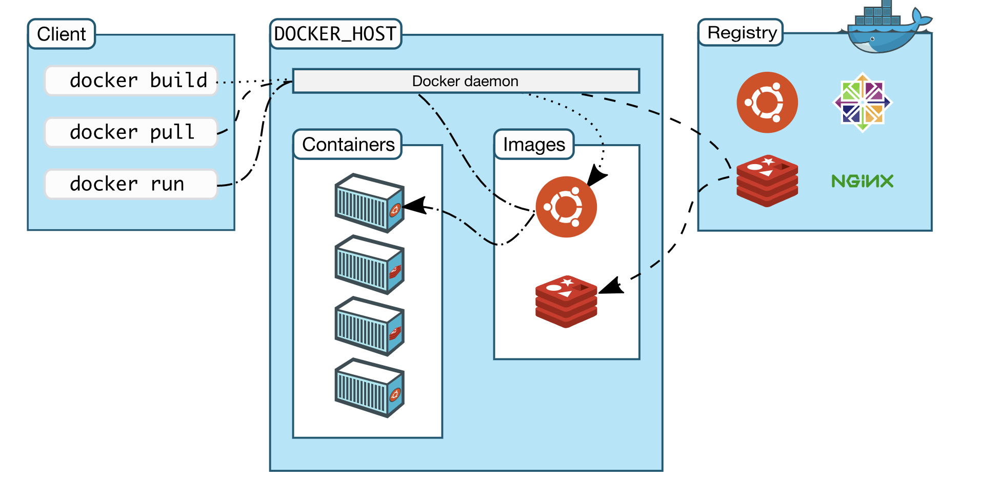
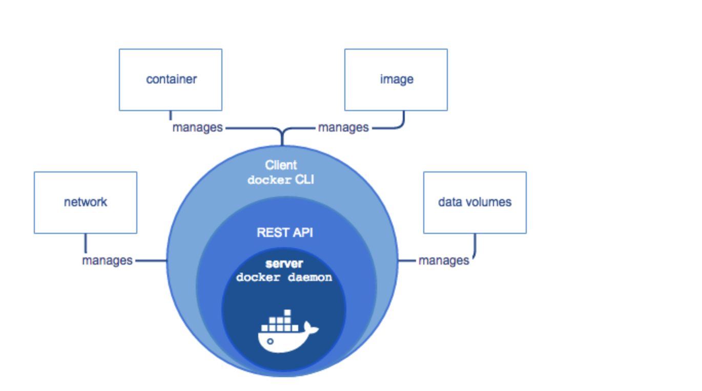
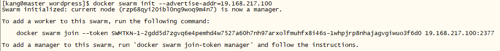
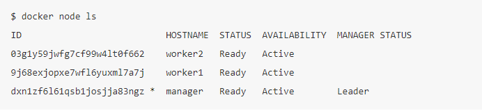

# Docker

## 目录

   * [Docker](#docker)
      * [目录](#目录)
      * [Docker简介](#docker简介)
         * [Docker是什么](#docker是什么)
         * [Docker的用途](#docker的用途)
      * [Docker安装](#docker安装)
         * [Docker for Centos](#docker-for-centos)
      * [Docker 架构和底层技术](#docker-架构和底层技术)
         * [Docker Engine](#docker-engine)
      * [Docker对象](#docker对象)
         * [Docker Image](#docker-image)
            * [Image的获取](#image的获取)
            * [Image命令](#image命令)
         * [Container](#container)
            * [Container命令](#container命令)
            * [Docker File](#docker-file)
            * [容器的操作](#容器的操作)
         * [Docker Network](#docker-network)
            * [常用工具](#常用工具)
            * [网络命名空间](#网络命名空间)
            * [Network drivers](#network-drivers)
               * [创建自定义bridge](#创建自定义bridge)
               * [多机器通信](#多机器通信)
            * [Docker link](#docker-link)
            * [Docker 容器端口本地映射](#docker-容器端口本地映射)
         * [data volumes](#data-volumes)
      * [Docker 持久化](#docker-持久化)
         * [基于本地文件系统的Volume](#基于本地文件系统的volume)
            * [Volume的类型](#volume的类型)
      * [Docker管理](#docker管理)
         * [Docker Compose](#docker-compose)
            * [Docker Compose的安装](#docker-compose的安装)
               * [Linux环境需要单独安装](#linux环境需要单独安装)
            * [docker-compose.yml](#docker-composeyml)
               * [案例模板](#案例模板)
               * [三大概念](#三大概念)
            * [Docker Compose常用命令](#docker-compose常用命令)
            * [水平扩展和负载均衡](#水平扩展和负载均衡)
         * [Docker Swarm](#docker-swarm)
            * [创建Docker Swarm集群](#创建docker-swarm集群)
               * [创建三个docker主机](#创建三个docker主机)
               * [搭建集群环境](#搭建集群环境)
            * [部署服务](#部署服务)
         * [Kubenentes(k8s)](#kubenentesk8s)
            * [简介](#简介)
            * [k8s整体架构](#k8s整体架构)
            * [k8s Master](#k8s-master)
            * [k8s环境搭建](#k8s环境搭建)
               * [Minikube搭建k8s单节点环境](#minikube搭建k8s单节点环境)
                  * [安装步骤](#安装步骤)
            * [ReplicationController](#replicationcontroller)
               * [模板](#模板)
            * [k8s案例](#k8s案例)
      * [实践项目](#实践项目)

## Docker简介

### Docker是什么

> Docker是一个开发，运输和运行应用程序的开放平台

> Linux容器是基于Linux内核，对进程进行封装隔离，Docker在容器的基础上，进行进一步封装，提供简单易用的容器使用接口

### Docker的用途

- 提供一次性的环境
- 提供弹性的云服务
- 组建微服务架构

## Docker安装

### Docker for Centos

- 安装 [VirtualBox](https://www.virtualbox.org/wiki/Downloads)
- 安装 [Vagrant](https://www.vagrantup.com/downloads.html)  
新建目录--> vagrant init centos/7(生成vagrant file) --> vagrant up（下载并打开虚拟机）--> vagrant ssh(进入虚拟环境)  
[Vagrant库](https://app.vagrantup.com/boxes/search)  
- 其他命令:  
     vagrant status  
     vagrant destroy

- 安装[Docker](https://docs.docker.com/v17.12/install/linux/docker-ce/centos/#install-docker-ce-1)  

## Docker 架构和底层技术 



### Docker Engine



> CLI使用Docker REST API通过脚本或直接CLI命令控制Docker守护程序或与Docker守护程序交互。许多其他Docker应用程序使用底层API和CLI。

- 后台守护进程（dockerd）
- REST API Server，和daemon进行通信
- 命令行界面 （docker）

> 守护程序创建和管理Docker对象，例如image，container，network和data volumes

## Docker对象
### Docker Image

> - 文件和meta data的集合
> - 分层的，并且每一层都可以添加改变删除文件，成为一个新的image
> - 不同的image可以共享相同的layer
> - image本身是只读的

#### Image的获取

- Build form Dockerfile

> docker build -t name:tag .

- Pull form Registry

> docker pull [image](https://hub.docker.com/)

#### Image命令

- docker image ls
- docker image rm [imageName]

### Container

> - 通过Image创建
> - 在Image layer之上建立一个container layer（可读写）
> - Image负责app的存储和分发，Container负责运行app

#### Container命令

- docker commit [image name] [new image]  
把修改过的container创建image
- docker inspect [container id]
获取container详细信息

#### Docker File

```bash
# 制作base image
FROM python:2.7-slim

# 指定工作路径
WORKDIR /app

# 复制当前目录内容到指定路径
COPY . /app

# 运行命令，会生成新的分层
RUN pip install --trusted-host pypi.python.org -r requirements.txt

# 暴露端口供外界访问
EXPOSE 80

# 定义环境变量
ENV NAME World

# 指定在容器中运行命令或提供参数
CMD ["python", "app.py"]
```
> LABEL:给镜像添加标签  
LABEL com.example.version="0.0.1-beta"  
LABEL vendor1="ACME Incorporated"

> RUN:执行命令并创建新的Image Layer  
RUN apt-get update && apt-get install -y \\  
    package-bar \\  
    package-baz \\  
    package-foo 

> CMD:设置容器启动后默认执行的命令和参数  

> ENTRYPOINT:设置容器启动时运行的命令，CMD则提供参数

> ADD&&COPY:功能相似，ADD具有解压功能

#### 容器的操作

```bash
docker exec -it [container id] /bin/bash
docker exec -it [container id] python
```

### Docker Network

#### 常用工具

> ping ：验证ip的可达性  
ping [ip地址]  
> telnet：验证服务的可用性  
telnet [ip] [port]  

#### 网络命名空间

> 容器有独立的网络命名空间，并且能相互ping通  
> ip a查看网络

#### Network drivers

> 单机通信网络默认的三种driver 
  

```bash
# none只可以通过exec访问容器，其他方式无法访问
docker run -d --name test --network none busybox /bin/sh -c "while true; do sleep 3600; done"
```

```bash
# host和主机共享网络命名空间，端口会发生冲突
docker run -d --name test --network host busybox /bin/sh -c "while true; do sleep 3600; done"
```

  
创建容器默认会连接bridge，通过veth pair进行连接，通过NAT访问外网，本地可访问bridge网络

>     docker network ls  //查看network列表  
>     docker network inspect [network id] //查看network的详细信息
>     brctl show //查看所有bridge网络的详细信息  

##### 创建自定义bridge

>     docker network create -d bridge my-bridge  //创建bridge网络
>     docker run -d --name test3 --network my-bridge busybox /bin/sh -c "while true; do sleep 3600; done" //指定network
>     docker network connect my-bridge test2 //加入自定义bridge的容器自动link，既可以使用名字代替ip地址

##### 多机器通信

- overlay网络和etcd实现（有时间再研究4-10）

#### Docker link

>     #创建两个容器，test2容器通过--link 指定test1,在test2容器内部就可以使用test1替代test1容器的ip地址  
>     docker run -d --name test1  busybox /bin/sh -c "while true; do sleep 3600; done"  
>     docker run -d --name test2 --link test1 busybox /bin/sh -c "while true; do sleep 3600; done"  

#### Docker 容器端口本地映射

>     docker run --name web -d -p 8080:80 nginx //容器80端口映射本地8080端口

### data volumes

> 详见下一章

## Docker 持久化

### 基于本地文件系统的Volume

```bash
可以在执行Docker create或Docker run时，通过-v参数将主句的目录作为容器的数据卷。  
```

#### Volume的类型

- 受管理的data Volume，由docker后台自动创建。  

```bash
# 通过Dockerfile指定volume
Dockerfile:  
     容器内部路径
     VOLUME /var/lib/mysql
# 查看volume列表
docker volume ls
# volume名字默认是随机生成的，可以指定名字【mysql】
docker run -v mysql:/var/lib/mysql --name mysql1 mysql
# 这样可以使用名字叫【mysql】的volume
docker run -v mysql:/var/lib/mysql --name mysql2 mysql
```

- 绑定挂载的Volume，具体挂载位置可以由用户指定。  
docker run -v [本地目录]:[容器目录]

## Docker管理

### Docker Compose

```txt
Docker Compose是一个工具  
可以通过yml文件定义多容器的docker应用  
通过yml文件的定义去创建或者管理多个容器  
```

#### Docker Compose的安装

##### Linux环境需要单独安装

>     sudo curl -L "https://github.com/docker/compose/releases/download/1.24.0/docker-compose-$(uname -s)-$(uname -m)" -o /usr/local/bin/docker-compose  

>     sudo chmod +x /usr/local/bin/docker-compose

>     docker-compose --version

#### docker-compose.yml

##### 案例模板

```bash
version: '3'

services:

  wordpress:
    image: wordpress
    ports:
      - 8080:80
    environment:
      WORDPRESS_DB_HOST: mysql
      WORDPRESS_DB_PASSWORD: root
    networks:
      - my-bridge

  mysql:
    image: mysql
    environment:
      MYSQL_ROOT_PASSWORD: root
      MYSQL_DATABASE: wordpress
    volumes:
      - mysql-data:/var/lib/mysql
    networks:
      - my-bridge

volumes:
  mysql-data:

networks:
  my-bridge:
    driver: bridge
```

```bash
version: "3"

services:

  redis:
    image: redis

  web:
    build:
      context: .
      dockerfile: Dockerfile
    ports:
      - 8080:5000
    environment:
      REDIS_HOST: redis

```

##### 三大概念

- Services

```text
一个service代表一个container  
Service的启动类似docker run，可以指定network和volume
```

- Networks
- Volumes

#### Docker Compose常用命令

```bash
# 根据-f指定的yml文件启动，默认【docker-compose.yml】，可不加-f  
docker-compose -f docker-compose.yml up [-d]
```

```bash
# 获取docker compose列表  
docker-compose ps
```

```bash
# 停止并移除  
docker-compose down  
# 停止  
docker-compose stop  
```

```bash
# 在运行的容器中执行命令，不用加-it  
docker-compose exec mysql bash  
```

#### 水平扩展和负载均衡

```bash
采用模板2的docker-compose.yml，并把ports移除  
# 启动三个web服务
docker-compose up scale web=3 -d  
```

[负载均衡案例](https://github.com/kangapp/Docker/tree/master/src/lb-scale)

### Docker Swarm

> Docker Swarm是Docker引擎内置的集群管理和编排工具  

  
  

#### 创建Docker Swarm集群

##### 创建三个docker主机

todo  //三种方式  

##### 搭建集群环境

  

```bash
#选择一台Docker主机作为管理节点，并在管理节点初始化一个Swarm集群  
docker swarm init --advertise-addr=19.168.217.100
```

```bash
#添加两个Docker主机作为工作节点，在工作节点输入以下命令加入集群  
docker swarm join --token SWMTKN-1-2gdd5d7zgvq6e4pemhd4w7527a60h7nh97arxolfmuhfx8i46s-1whpjrp8nhajagvgiwuo3f6d0 19.168.217.100:2377
```

  

```bash
#进入管理节点查看集群  
docker node ls
```

#### 部署服务

> 使用docker service命令管理Swarm集群，只能在管理节点运行

```bash
#新建服务，在Swarm集群运行一个名为nginx的服务  
docker service create --replicas 3 -p 80:80 --name nginx nginx:1.13.7-alpine
```

```bash
#查看服务列表  
docker service ls  

ID                  NAME                MODE                REPLICAS            IMAGE                 PORTS
kc57xffvhul5        nginx               replicated          3/3                 nginx:1.13.7-alpine   *:80->80/tcp
```

```bash
#查看某个服务详情  
docker service ps nginx  

ID                  NAME                IMAGE                 NODE                DESIRED STATE       CURRENT STATE                ERROR               PORTS
pjfzd39buzlt        nginx.1             nginx:1.13.7-alpine   swarm2              Running             Running about a minute ago
hy9eeivdxlaa        nginx.2             nginx:1.13.7-alpine   swarm1              Running             Running about a minute ago
36wmpiv7gmfo        nginx.3             nginx:1.13.7-alpine   swarm3              Running             Running about a minute ago
```

```bash
#服务伸缩  
docker service scale nginx=5  
```

```bash
#删除服务  
docker service rm nginx  
```

### Kubenentes(k8s)

#### 简介

```bash
Kubernetes是一个可移植，可扩展的开源平台，用于管理容器化工作负载和服务，有助于声明性配置和自动化。  
* 容器的平台  
* 微服务平台  
* 便携式云平台  
```

#### k8s整体架构

  

#### k8s Master

  

* API Server  

```bash
k8s控制集群的前端组件，用于水平扩展集群
```

* etcd  

```bash
一致且高可用的键值存储，用于k8s所有集群数据的后背存储
```

* Scheduler管理  

```bash
监控新建的没有分配节点的pod，挑选节点让其运行
```

* Controller-manager  

```bash
运行controller的组件  
Node Controller：当节点出现故障时复杂通知和响应  
Replication Controller：负责为系统中的每个复制控制器对象维护正确数量的pod  
Endpoint Controller：连接Services和pods  
Service Account & Token Controllers：为新命名空间创建默认帐户和API访问令牌  
```

  
  

#### k8s环境搭建

##### Minikube搭建k8s单节点环境

###### 安装步骤

* 安装[VirtualBox](https://www.virtualbox.org/wiki/Downloads)  

* 安装[kubectl](https://kubernetes.io/docs/tasks/tools/install-kubectl/#install-kubectl-binary-using-curl)  
`kubectl cluster-info //检查集群状态`  

* 安装[Minikube](https://kubernetes.io/docs/tasks/tools/install-minikube/#install-minikube)  
`minikube ssh  //进入虚拟机`

#### ReplicationController

>     ReplicationController确保一次运行指定数量的pod副本

##### 模板

```bash
apiVersion: v1
kind: ReplicationController
metadata:
  name: nginx
spec:
  replicas: 3
  selector:
    app: nginx
  template:
    metadata:
      name: nginx
      labels:
        app: nginx
    spec:
      containers:
      - name: nginx
        image: nginx
        ports:
        - containerPort: 80
```

#### k8s案例

* [传送门](https://github.com/kangapp/Docker/tree/master/src/k8s_demo)

## 实践项目

| 项目名                              | 介绍                                  |
| ----------------------------------- | -------------------------------------- |
| [基于python flask和redis的web应用部署](https://github.com/kangapp/Docker/tree/master/src/flask-redis) | 多容器复杂应用的部署 |
| [负载均衡案例](https://github.com/kangapp/Docker/tree/master/src/lb-scale) | Docker Compose |
| [投票案例](https://github.com/kangapp/Docker/tree/master/src/example-voting-app) | Docker Compose复杂应用 |