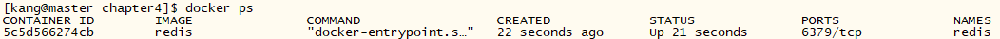

# Flask-redis部署

## redis容器启动

> docker run -d --name redis redis  

 

## flask容器启动

```bash
# 通过Dockefile创建image，暴露5000端口
docker build -t kangapp/redis .
```

```bash
# 通过--link绑定redis容器的ip，并通过-e设置环境变量，在app程序中使用REDIS_HOST
docker run -d -p 5000:5000 --link redis --name flask-redis -e REDIS_HOST=redis kangapp/redis
```